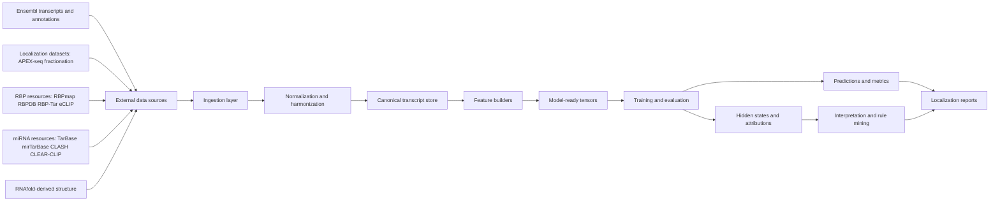

# PostGram Architecture

## System overview

PostGram should behave like a staged pipeline:

1. Collect and normalize transcript-centered evidence
2. Build position-aligned representations for each transcript or 3'UTR
3. Convert those representations into model inputs
4. Train and evaluate localization models
5. Export predictions, internal signals, and attribution-ready outputs
6. Summarize model-supported patterns into interpretable reports

The main architectural principle is that Aim 1 owns the canonical biological representation, Aim 2 owns the predictive backbone, and Aim 3 consumes model outputs without redefining the original data contracts.

## Detailed architecture



## Aim 1 architecture

Aim 1 is the data foundation. It should result in a standardized, position-aligned representation for each transcript.

### Inputs

- Ensembl transcript annotations and sequences
- localization labels from APEX-seq and fractionation-style datasets
- RBP annotations from motif databases and in vivo assays
- miRNA binding annotations from curated interaction resources
- structural summaries derived from folding tools such as RNAfold

### Processing stages

#### 1. Ingestion

Each source needs a dedicated adapter that reads raw source files and converts them into a common internal schema with explicit provenance.

Expected adapter outputs:

- transcript reference tables
- interval-style RBP annotations
- interval-style miRNA site annotations
- per-position or windowed structure scores
- localization labels and dataset metadata

#### 2. Harmonization

The harmonization layer resolves:

- transcript identifier mismatches
- gene naming inconsistencies
- coordinate systems
- per-source confidence or score normalization
- experimental context metadata

This layer should preserve provenance rather than flattening it away.

#### 3. Canonical transcript representation

The core Aim 1 object should be a transcript-centered record with:

- transcript ID
- gene name
- transcript or 3'UTR sequence
- region metadata
- position-aligned feature channels
- localization labels
- source metadata

Conceptually, each transcript becomes:

`sequence + aligned annotations + labels + provenance`

### Canonical data model

At implementation time, this can be split into three levels:

1. Raw source layer
2. Normalized feature layer
3. Final modeling dataset layer

Recommended artifact types:

- `raw/*.tsv|json|bed`
- `interim/*.parquet|jsonl`
- `processed/transcripts.jsonl`
- `processed/metadata.json`

## Aim 2 architecture

Aim 2 consumes the Aim 1 transcript records and turns them into predictive models for localization.

### Input encoding

The model input should be built from 3'UTR-centered records.

Per-position information:

- nucleotide identity: A, C, G, U
- optional region embedding
- RBP channels
- miRNA channels
- structure channels such as accessibility and pairing probability

This produces a matrix:

`X in R^(seq_len x feature_dim)`

where `feature_dim` combines sequence embedding and annotation channels.

### Feature builder responsibilities

The feature builder should:

- tokenize sequence
- align annotation channels to nucleotide positions
- support truncation, padding, or bucketing by sequence length
- emit masks for padded positions
- preserve transcript IDs and label metadata for downstream analysis

### Model backbone

The proposed baseline is a Transformer encoder with:

- 6-8 layers
- hidden size 256-512
- 8-12 attention heads

Global transcript representation options:

- `CLS` token
- mean pooling
- attention pooling

### Prediction heads

Main supported head:

- localization head for binary or multilabel compartment prediction

Primary initial tasks:

- P-body enriched vs non-P-body enriched
- stress granule enriched vs non-stress granule enriched

Potential extension heads:

- compartment score regression
- auxiliary post-transcriptional outputs if later adopted

### Training and evaluation

Training stack responsibilities:

- split generation
- class imbalance handling
- optimizer and scheduler management
- checkpointing
- experiment logging

Evaluation stack responsibilities:

- held-out transcript evaluation
- cross-dataset evaluation when multiple sources exist
- stratified performance by transcript length and feature density
- export of confusion tables and task-specific metrics

Recommended metrics:

- AUROC
- AUPRC
- calibration summaries
- robustness slices by transcript length and annotation density

## Aim 3 handoff architecture

Aim 3 should not start from raw data again. It should consume:

- trained model checkpoints
- transcript-level predictions
- hidden states or pooled embeddings
- attribution outputs
- transcript metadata from Aim 1

### Interpretation outputs

Two useful layers of interpretation match your project text:

1. Local motif-centered summaries
2. Global transcript-level summaries

Interpretation components should support:

- transcript grouping by predicted localization
- motif window extraction
- co-occurrence and spacing analysis
- attribution-weighted feature ranking
- concise text summaries for each localization contrast

## Data contracts between aims

The most important design rule for this repo is to make aim-to-aim handoffs explicit.

### Aim 1 to Aim 2

Aim 1 should export:

- processed transcript records
- label definitions
- feature channel definitions
- train/validation/test split manifests

### Aim 2 to Aim 3

Aim 2 should export:

- per-transcript predictions
- evaluation tables
- attribution maps
- pooled representations or hidden-state summaries

## Recommended directory structure

```text
PostGram/
├── configs/
├── data/
│   ├── raw/
│   ├── interim/
│   └── processed/
├── docs/
├── examples/
├── outputs/
│   ├── datasets/
│   ├── models/
│   ├── metrics/
│   └── reports/
├── src/postgram/
│   ├── cli.py
│   ├── config.py
│   ├── dataset.py
│   ├── ingest/
│   ├── normalize/
│   ├── features/
│   ├── modeling/
│   ├── evaluation/
│   ├── interpretation/
│   └── io/
└── tests/
```

## Initial implementation priorities

If we build this incrementally, the clean order is:

1. Aim 1 ingestion adapters and normalized schemas
2. position-aligned feature channel generation
3. saved processed dataset contract
4. baseline Transformer training loop
5. evaluation and export format
6. attribution and interpretation layer
