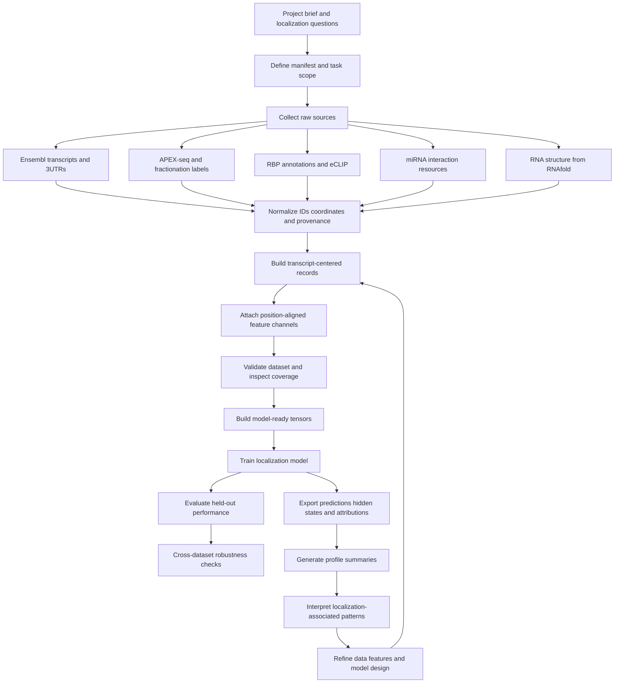
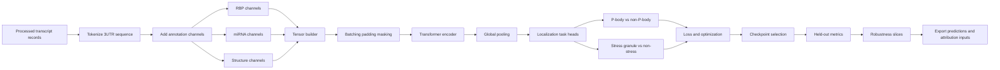

# PostGram Flowcharts

These flowcharts now follow the pasted project description more closely. The first one is the end-to-end architecture. The second one zooms in on the modeling pipeline.

## End-to-end pipeline

## Aim 2 modeling pipeline

## Reading the flow

- The end-to-end diagram shows how Aim 1 outputs become Aim 2 inputs and eventually feed Aim 3 interpretation.
- The Aim 2 diagram focuses on the tensorization and Transformer training path.
- The feedback loop is intentional: interpretation should help refine data channels and model choices rather than sit outside the pipeline.
